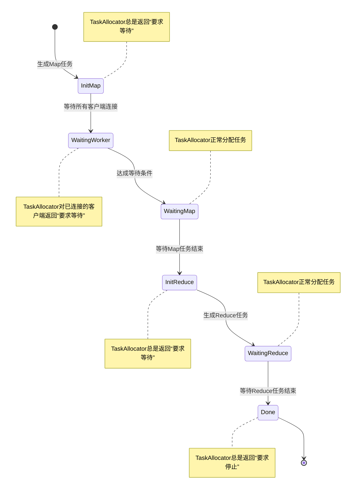
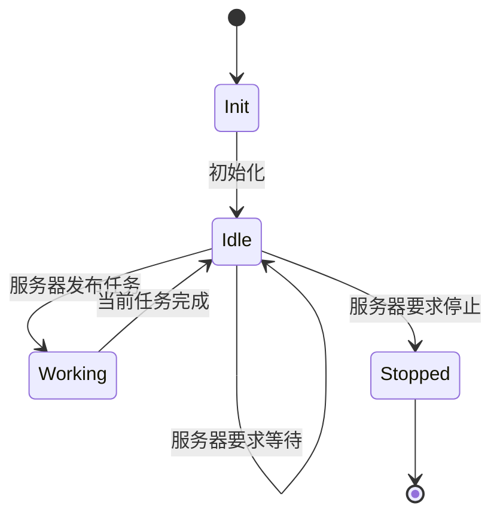

# Project-Castor

## 简介
*Project-Castor*是一个受[MIT 6.824 Lab1](https://pdos.csail.mit.edu/6.824/labs/lab-mr.html)启发，利用Go语言实现的MapReduce框架。与原Lab相比，*Project-Castor*：

- 使用TCP Socket代替IPC Socket。
- 将输入文件等大分块，以达到一定程度的负载均衡。
- 具有结构化的接口格式与简明的接口数量。Coordinator一共仅暴露了5个接口，且均使用互斥锁或(和)channel防止并发时可能出现的问题
- ***【特色】*** 实现了客户端的安全连接，实现了客户端超时监控与任务失败重试。客户端的安全连接包括注册-等待任务-执行任务-退出的全流程。客户端在任意阶段出现错误，服务器都可以恢复未执行完的任务给其余客户端，保证MapReduce任务的完整进行。

这些特性使得*Project-Castor*支持**运行在完整的分布式系统上**，而非原Lab所模拟的单机伪分布式。

参见[项目亮点](#项目亮点)。

## 安装和运行
### 版本
本系统目前仅在以下版本中测试过：

- go1.21.0 darwin/arm64
- go1.21.12 linux/arm64

其他版本未经测试，暂不能保证所有功能完整可用。

因此，建议使用 **1.21或以上** 版本的Go。

### 下载
使用以下指令下载本仓库并进入文件夹：
```bash
git clone https://github.com/PulsarisDev/Project-Castor.git
cd Project-Castor
```
### 运行
要使用*Project-Castor*完成MapReduce任务，需要1个Coordinator和n(n>=1)个Worker进程。使用以下指令分别启动这些进程：

#### Coordinator
```bash
go run coordinator.go [输入文件夹] [输出文件夹]
```
如：
```bash
go run coordinator.go input output
```
其中输出文件夹需要保证是空的。

#### Worker
在启动任何Worker进程之前，确保你已经配置好Worker的服务器地址。服务器地址的配置见下文[worker.json](#workerjson)文件中。
```bash
go run worker.go [pluginName].so
```
如：
```bash
go run worker.go mrapps/wc.so
```

### 文件结构
|名称|类型|备注|可编辑|
|-|-|-|-|
|coordinator.go|go代码文件|服务端源代码|不建议|
|coordinator.json|json文件|服务端配置文件|是|
|worker.go|go代码文件|客户端源代码|不建议|
|worker.json|json文件|客户端配置文件|是|
|types|文件夹|项目依赖的类型和函数|不建议|
|mrapps|文件夹|MR插件源代码|是|
|input|文件夹|示例输入文件夹|是|
|output|文件夹|示例输出文件夹|是|


## 配置文件
### coordinator.json
#### 默认格式
```json
{
    "config":{
        "server.port":      1234,
        "server.reg.mode":  "worker",
        "server.reg.arg":   2,
        "mr.map.chunkSize": "256KB",
        "mr.reduce.num":    3
    }
}
```

#### server (服务端设置)
|名称|含义|类型|取值|
|-|-|-|-|
|server.port|服务器监听端口|int|1024 ~ 65535|
|server.reg.mode|等待注册方式|string|"worker", "none"|
|server.reg.arg|等待注册参数|int|仅当server.reg.mode不为"none"时有效|

**server.reg.mode**的值本质上是指定服务器判断是否放弃等待新客户端的链接而进入执行MR任务的条件。

- 当server.reg.mode为"worker"时，代表服务器会以客户端的连接数量作为判断条件。一旦已连接的客户端数量达到server.reg.arg提供的值，服务器会立刻进入执行MR任务的状态，开始向各客户端发布任务。在此之前，服务器会要求已连接的各客户端先行等待。

- 当server.reg.mode为"none"时，代表服务器不设置任何判断条件，在可以向客户端发布任务时（一般为第一个客户端连接时）立刻开始发布任务。因此，在这种状态下，服务器不会要求任何客户端先行等待。

- ***【待实现的功能】*** 当server.reg.mode为"time"时，代表服务器会以启动时间作为判断条件。一旦服务器已经启动server.reg.arg提供的秒数，会立刻进入执行MR任务的状态，开始向各客户端发布任务（如果至少存在一个客户端的话）。如果此时不存在任何客户端，服务器会产生类似"none"的结果，即在第一个客户端连接时立即开始发布任务。

#### mr (MapReduce设置)
|名称|含义|类型|取值|
|-|-|-|-|
|mr.map.chunkSize|Map文件块大小|string|表示文件大小的字符串(大小写不敏感，不超过1GB)|
|mr.reduce.Num|Reduce任务数量|int|大于0|

**mr.map.chunkSize**的值决定了生成Map任务时，任务所包含的内容大小。由于输入文件的数量、大小均不定，因此*Project-Castor*会尝试将每个输入文件都分成mr.map.chunkSize大的块，**基于块而非基于文件**地生成Map任务，一定程度上确保各Map任务所需资源均衡。

**mr.reduce.Num**的值决定了生成Reduce任务的数量。一般建议设置为大于客户端数量的值，防止有客户端在Reduce阶段闲置。一个Reduce任务对应一个输出文件，因此该值也不应设置得过大，以免在后续处理输出文件时消耗太多资源。

### worker.json
#### 默认格式
```json
{
    "config":{
        "server.address":"localhost",
        "server.port":1234
    }
}
```

#### client (客户端设置)
|名称|含义|类型|取值范围|
|-|-|-|-|
|client.address|服务器IPv4|string|*符合IPv4格式的字符串*|
|client.port|服务器端口|int|1024 ~ 65535|

## 项目亮点
### 服务端 (Coordinator)
- 对于不同客户端，使用独立的go channel分别监听心跳包，而不是维护一整张表。这使得客户端保活监听由时间驱动型变为事件驱动型，更加节省资源。
- 5个接口，纯事件驱动，本身不含任何计时器：
    - RegisterHandler：处理客户端注册事件
    - UnregisterHandler：处理客户端注销事件
    - TaskAllocator：处理客户端请求任务事件，为客户端分配任务
    - DoneWorkHandler：处理客户端任务完成事件
    - HeartbeatHandler：处理客户端保活定期事件
- 5个接口均具有互斥锁，同一时间仅允许一个接口处理内存中的数据。
- 任意时间都可以处理任意客户端对任意接口的访问，能够辨认访问是否合法，并给出合理回应。
- 使用channel作为互斥的任务队列。在channel被占用时令新请求延迟200ms重试，达成简易流量控制。
- 通过令新请求延迟重试的方式，逻辑上杜绝了资源竞争与死锁（老请求总是会获得资源并释放资源）。
- 作为中转，将Mapper的结果在内存中重新分配给Reducer，过程中完全不会在硬盘中存储中间文件。
- DFA的设计思路，稳定高效。
- 根据当前状态，同一接口TaskAllocator会产生不同回应。

- 服务器分别记录所有任务和客户端，为任务和客户端分配不同uid。
- 在客户端状态异常时，服务器会根据客户端uid重置未完成的任务，并允许其余客户端重新执行该任务。
- 规范的代码及错误处理
- 简洁结构化的log系统，方便快速定位问题。

### 客户端 (Server)
- 使用外置文件配置设置，灵活性更大。
- DFA的设计思路，稳定高效。

- 规范的代码及错误处理
- 简洁结构化的log系统，方便快速定位问题。

## 插件开发规范
*Project-Castor*在插件开发方面与[MIT 6.824 Lab1](https://pdos.csail.mit.edu/6.824/labs/lab-mr.html)遵循相同的API，以保证最大兼容性。

简而言之，一个插件需要具有：

- ```package main```
- 一个Map函数，其类型为```func (string, string) []localtypes.Pair```。Map函数会对每一个文件块执行。
- 一个Reduce函数，其类型为```func (string, []string) string```。Reduce函数会对Map结果的每一个键执行。